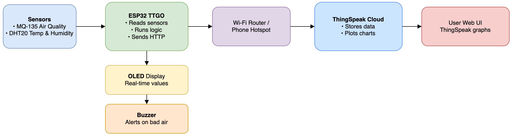

# Smart Home Air Quality Monitoring System

*Using ESP32, DHT20, MQ-135, OLED, Buzzer, and ThingSpeak*

> Team YZ — UCI CS147 Internet of Things Final Project
>
> Members: Qizhi Tian & Jiatong Liu

## Overview

Indoor air pollution often goes unnoticed, yet it directly affects health, comfort, and productivity. This project builds a **low-cost smart home air-quality monitoring system** using **ESP32**, which continuously measures:

+ Air quality (MQ-135)
+ Temperature & humidity (DHT20)
+ Real-time display on OLED
+ Cloud visualization through ThingSpeak
+ Alerts via buzzer and (future) mobile notification

The system helps users take immediate actions—open a window, use a fan, or turn on a purifier—when indoor air quality becomes poor.

## Hardware Components

| Component                           | Quantity |
| ----------------------------------- | -------- |
| ESP32 TTGO Board                    | 1        |
| MQ-135 Air Quality Sensor           | 1        |
| DHT20 Temperature & Humidity Sensor | 1        |
| OLED Display                        | 1        |
| Buzzer                              | 1        |
| Breadboard                          | 1        |
| Jumper Wires                        | Several  |

## System Architecture

**Communication Protocol:**

+ Wi-Fi (HTTP POST to ThingSpeak API) 
+ Cloud auto-generates line charts for AQI, temperature, and humidity.

## How It Works

1. ESP32 reads analog/digital sensor data
2. Values are displayed on the OLED
3. Data is sent to ThingSpeak via HTTP
4. ThingSpeak dashboard updates charts in real time
5. When AQI exceeds threshold → buzzer beeps

## Features

**Real-time sensing**

- Reads indoor air quality, temperature, and humidity every few seconds.

**OLED live display**

- Shows current AQI, temp, and humidity directly on the device.

**Cloud dashboard**

- Uploads sensor data to ThingSpeak for:

    + Trend charts

    + Historical logging

    + Remote viewing

**Alert system**

- Triggers buzzer when air quality becomes unsafe.
- Future extensions include mobile notifications.

**Low-cost and extensible**

- Uses inexpensive sensors and open-source platforms.

## Challenges & Solutions

### 1. MQ-135 unstable readings

Fluctuations caused by humidity, warm-up time, and noise.
**Solution:**

+ Indoor baseline calibration
+ Moving-average smoothing filter

### 2. Wi-Fi disconnection

Campus Wi-Fi is unstable.
**Solution:**

+ Use phone hotspot for stable uploads

### 3. Wiring issues

OLED, MQ-135, DHT20 all require power/data lines.
**Solution:**

+ Rebuild tighter wiring, color-coded cables

## Future Improvements

+ **Mobile App Alerts** (Blynk/Firebase push notifications)
+ **More sensors** (CO₂ MH-Z19, PM2.5 PMS5003, VOC sensors)
+ **Portable design** (battery + 3D-printed case)
+ **TinyML anomaly detection** on ESP32

## Demo Video

https://drive.google.com/file/d/1borxxHFF1Y4MG566SDp_l3mRBTA9cLzk/view?usp=sharing
